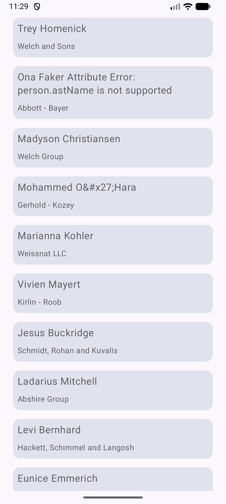
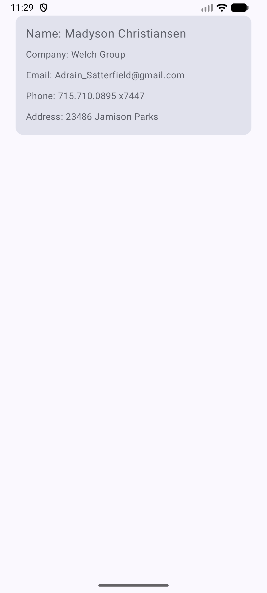
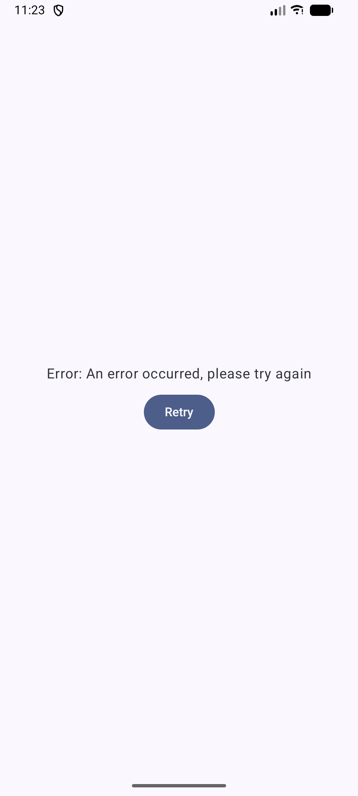
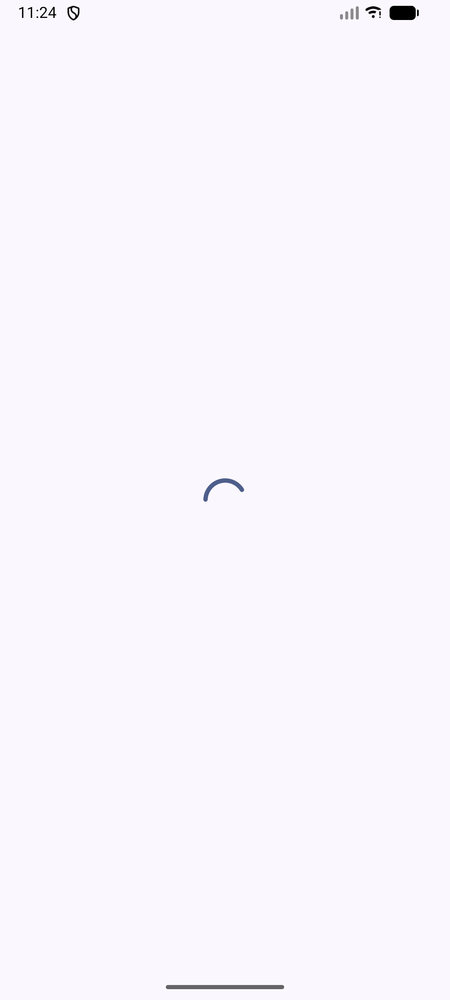

## Modularized-Architecture-App
This repository contains modularized architecture for simple app which includes list and details screens using modern Android + clean architecture principles.

## Technologies used
- Kotlin
- Jetpack Compose
- Modularized architecture with MVVM
- RestApis (Retrofit2)
- Koin
- Coroutines

## Demo Video

## Screenshots

